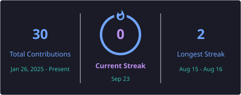

<!-- ========================================================= -->
<!--                 SHAIK TASLEEM PORTFOLIO                  -->
<!-- ========================================================= -->

<!-- ======================== HERO =========================== -->

<h1>Software Engineering &nbsp;|&nbsp; Full Stack Developer</h1>

Building full-stack applications and exploring AI-powered solutions.

 

 

<!-- ========================================================= -->
<!--                    ABOUT ME                               -->
<!-- ========================================================= -->

<h1>👋 About Me</h1>

🎓 B.Tech Computer Science Student | 2027 Graduate
  
💻 Software Engineering & Full Stack Developer
  
🤖 Exploring AI, Machine Learning and Retrieval-Augmented Generation
  
🚀 Interested in building practical, user-focused software solutions
  
📚 Continuously learning, building and improving

 

<!-- ========================================================= -->
<!--                    EXPERIENCE                             -->
<!-- ========================================================= -->

<h1>💼 Experience</h1>

 

<table>
<tr>
<td width="90%">

<h2>💻 Full Stack Intern</h2>

<b>21 September 2025 – 21 March 2026</b>

Completed a six-month Full Stack Development internship with
hands-on experience in building, integrating and improving
full-stack web applications.

<h3>🔹 Responsibilities & Learning</h3>

<ul align="left">
<li>Developed and improved responsive web application interfaces.</li>
<li>Worked with frontend and backend technologies in a full-stack environment.</li>
<li>Implemented and integrated REST APIs.</li>
<li>Worked with databases and application data management.</li>
<li>Used Git and GitHub for version control and collaborative development.</li>
<li>Worked on debugging, testing and improving application functionality.</li>
<li>Gained practical experience in full-stack application development.</li>
</ul>

<h3>🛠️ Technologies</h3>

</td>
</tr>
</table>

 

<!-- ========================================================= -->
<!--                    TECHNICAL ARSENAL                      -->
<!-- ========================================================= -->

<h1>🛠️ Technical Arsenal</h1>

Technologies and concepts I use to design, build and deploy applications.

 

<h3>💻 Languages</h3>

  

  

<h3>🎨 Frontend</h3>

  

<h3>⚙️ Backend</h3>

  

  

<h3>🗄️ Databases</h3>

  

<h3>🤖 AI / ML / RAG</h3>

  

<h3>☁️ Tools & Platforms</h3>

  

  

<h3>🧠 Core Computer Science</h3>

  

 

<!-- ========================================================= -->
<!--                    FEATURED PROJECTS                      -->
<!-- ========================================================= -->

<h1>🚀 Featured Projects</h1>

Projects demonstrating my experience in full-stack development,
AI-powered applications and software engineering.

 

<!-- ========================================================= -->
<!--                    GROUNDED RAG                           -->
<!-- ========================================================= -->

<h2>🔎 Grounded RAG System</h2>

An AI-powered Retrieval-Augmented Generation system designed to
answer questions from uploaded documents using semantic retrieval
and grounded evidence.

<table>
<tr>

<td width="50%" valign="top">

<h3>💡 Overview</h3>

The system processes documents, creates searchable representations,
retrieves relevant information and generates answers grounded in
the retrieved evidence.

<h3>✨ Highlights</h3>

<ul>
<li>📄 Document ingestion and processing</li>
<li>✂️ Text chunking for retrieval</li>
<li>🧠 Embedding-based semantic search</li>
<li>🔎 FAISS vector similarity search</li>
<li>🤖 Retrieval-Augmented Generation</li>
<li>📚 Evidence-grounded responses</li>
<li>⚡ Interactive Streamlit interface</li>
</ul>

</td>

<td width="50%" valign="top">

<h3>🛠️ Tech Stack</h3>

  

  

<h3>🔗 Links</h3>

  

</td>

</tr>
</table>

  

<!-- ========================================================= -->
<!--                    NUTRICLOUDMONITOR                      -->
<!-- ========================================================= -->

<h2>🥗 NutriCloudMonitor</h2>

A full-stack nutrition monitoring platform designed to provide
users with an interactive application for managing and visualizing
nutrition-related information.

<table>
<tr>

<td width="50%" valign="top">

<h3>💡 Overview</h3>

NutriCloudMonitor combines a responsive frontend, backend services
and database integration to provide a structured platform for
nutrition-related monitoring and visualization.

<h3>✨ Highlights</h3>

<ul>
<li>🔐 JWT-based user authentication</li>
<li>🛡️ Role-based access control</li>
<li>📊 Interactive nutrition dashboard</li>
<li>📈 Nutrition data visualization</li>
<li>🔄 REST API integration</li>
<li>🗄️ MongoDB database integration</li>
<li>📱 Responsive web interface</li>
</ul>

</td>

<td width="50%" valign="top">

<h3>🛠️ Tech Stack</h3>

  

  

<h3>🔗 Links</h3>

  

</td>

</tr>
</table>

  

<!-- ========================================================= -->
<!--                    DOCSPOT                                -->
<!-- ========================================================= -->

<h2>🏥 Docspot Appointment Booking</h2>

A full-stack healthcare appointment booking platform that provides
an interactive system for managing appointments and connecting
users with healthcare services.

<table>
<tr>

<td width="50%" valign="top">

<h3>💡 Overview</h3>

Docspot provides a structured appointment booking experience with
frontend interaction, backend APIs and database integration for
managing application data.

<h3>✨ Highlights</h3>

<ul>
<li>👤 User registration and authentication</li>
<li>👨‍⚕️ Doctor and patient workflow</li>
<li>📅 Appointment scheduling</li>
<li>🕐 Appointment slot management</li>
<li>🔐 Secure authentication</li>
<li>🔄 REST API integration</li>
<li>🗄️ MongoDB data management</li>
<li>📱 Responsive user interface</li>
</ul>

</td>

<td width="50%" valign="top">

<h3>🛠️ Tech Stack</h3>

  

  

<h3>🔗 Links</h3>

  

</td>

</tr>
</table>

  

<!-- ========================================================= -->
<!--                    FLIGHT FINDER                           -->
<!-- ========================================================= -->

<h2>✈️ Flight Finder – Flight Booking Application</h2>

A full-stack MERN flight booking application that allows users
to search flights, view available options, select seats and
manage flight bookings through an interactive web interface.

<table>
<tr>

<td width="50%" valign="top">

<h3>💡 Overview</h3>

A team-based full-stack application developed to provide a
complete online flight booking experience with authentication,
flight management, seat selection and booking workflows.

<h3>✨ Highlights</h3>

<ul>
<li>🔎 Flight search by source and destination</li>
<li>✈️ Flight availability and information</li>
<li>🪑 Interactive seat selection</li>
<li>🎫 Flight booking management</li>
<li>🔐 JWT-based authentication</li>
<li>💳 Payment integration</li>
<li>👨‍💼 Admin dashboard</li>
<li>📋 Booking management</li>
<li>📱 Responsive web interface</li>
</ul>

</td>

<td width="50%" valign="top">

<h3>🛠️ Tech Stack</h3>

  

  

<h3>👥 Team Project</h3>

<b>Team Leader:</b> Shaik Tasleem

 

</td>

</tr>
</table>

 

<!-- ========================================================= -->
<!--                    ACHIEVEMENTS                           -->
<!-- ========================================================= -->

<h1>🏆 Achievements</h1>

 

<table>
<tr>

<td align="center" width="33%">

<h1>🥇</h1>

<h2>1st Rank</h2>

College Kaggle Competition

  

<b>2026</b>

</td>

<td align="center" width="33%">

<h1>🥈</h1>

<h2>2nd Rank</h2>

College Hackathon

  

<b>2024</b>

</td>

<td align="center" width="33%">

<h1>🥈</h1>

<h2>2nd Rank</h2>

College Web Development Event

  

<b>2025</b>

</td>

</tr>
</table>

 

<!-- ========================================================= -->
<!--                    CURRENTLY LEARNING                     -->
<!-- ========================================================= -->

<h1>📚 Currently Learning</h1>

 

 

<!-- ========================================================= -->
<!--                    GITHUB STATISTICS                      -->
<!-- ========================================================= -->

<h1>📊 GitHub Statistics</h1>

 

 

<!-- ========================================================= -->
<!--                    CONTRIBUTION GRAPH                     -->
<!-- ========================================================= -->

<h2>🐍 Contribution Activity</h2>

 

<!-- ========================================================= -->
<!--                    CONNECT WITH ME                        -->
<!-- ========================================================= -->

<h1>📫 Connect With Me</h1>

 

  

📧 <b>shaiktasleem822@gmail.com</b>

 

<!-- ========================================================= -->
<!--                    FOOTER                                 -->
<!-- ========================================================= -->

